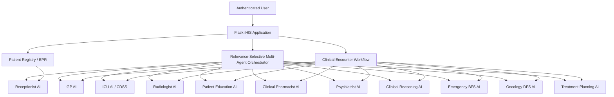

# Intelligent Hospital Information System (iHIS)
## AI in Healthcare Semester Project

**iHIS** is a modular Flask-based Intelligent Hospital Information System developed as an academic **AI in Healthcare** semester project. It combines a conventional hospital information system foundation with multiple educational AI/ML modules, specialist agents, clinical decision-support workflows, and a relevance-selective multi-agent orchestrator.

> **Academic / educational prototype only.**  
> This system is **not clinically validated**, is not a certified medical device, and must not be used for diagnosis, treatment, triage, medication decisions, or other real-world clinical decision-making.

---

## Project Status

The implemented project covers the required development milestones through **Week 12**, with a bonus Radiation Oncology module and reproducibility-focused automated tests.

Key specification-alignment upgrades include:

- **Week 4:** PyTorch **Convolutional Neural Network (CNN)** for educational chest X-ray classification.
- **Week 5:** genuine **Retrieval-Augmented Generation (RAG)** using local TF-IDF retrieval plus an LLM served through **Groq**.
- **Week 10:** actual **Breadth-First Search (BFS)** emergency diagnostic reasoning.
- **Week 11:** actual **Depth-First Search (DFS)** oncology pathway exploration plus an educational reinforcement-learning treatment-planning simulation.
- **Week 12:** **relevance-selective multi-agent orchestration**, where only clinically relevant specialist agents are invoked for a given demonstration scenario.

Latest automated validation:

```text
7 passed
```

---

## System Objectives

The project demonstrates how AI components can be integrated into a hospital information system while preserving:

- patient and encounter linkage;
- role-based workflows;
- modular specialist services;
- AI traceability;
- explicit uncertainty and limitations;
- explainable educational outputs;
- selective agent invocation rather than indiscriminate all-agent execution;
- reproducible local installation and testing.

---

## Technology Stack

### Web application

- Python 3.12
- Flask
- Jinja2
- Flask-SQLAlchemy
- Flask-Migrate
- Flask-Login
- Flask-WTF
- SQLite by default

### AI / ML

- PyTorch
- scikit-learn
- NumPy
- pandas
- Pillow
- joblib
- OpenAI-compatible Python client
- Groq API for Week 5 LLM generation

### Testing

- pytest

Dependency versions and minimum versions are defined in [`requirements.txt`](requirements.txt).

---

## High-Level Architecture



The Week 12 orchestrator examines the available structured case information, selects only relevant specialist agents, records which agents were intentionally skipped, runs the selected services, and produces an integrated educational report.

---

## Milestone / Week Coverage

| Week | Requirement / Module | Implementation |
|---|---|---|
| **1** | Core HIS, registration, EPR, navigation, Receptionist AI | Flask HIS foundation, patient registry/profile, role-based navigation, Receptionist routing |
| **2** | Disease prediction | GP AI disease-prediction workflow with model artifacts and results |
| **3** | CDSS / ICU | ICU vital-sign analysis, alerts, critical-intervention decision support |
| **4** | X-ray AI | PyTorch CNN for educational X-ray classification with model traceability |
| **5** | Chatbot / RAG | Local knowledge retrieval + Groq-hosted LLM grounded generation |
| **6** | Medication recommendation / interaction | Clinical Pharmacist AI medication-safety workflow |
| **7** | Mental-health assessment | Psychiatrist AI depression/anxiety screening |
| **9** | Differential diagnosis | Clinical Reasoning AI symptom-to-differential engine |
| **10** | Emergency diagnostic tree | BFS-based emergency reasoning |
| **11** | Oncology pathway + treatment optimization | DFS oncology pathway plus educational RL treatment-planning simulation |
| **12** | Connected specialist agents | Relevance-selective multi-agent orchestration and integrated reporting |
| **Bonus** | Radiation Oncology | Additional educational Radiation Oncology module |

---

# AI Specialist Modules

## 1. Receptionist AI

Provides first-contact educational routing based on the patient's presenting complaint and duration.

Typical responsibilities:

- intake;
- routing;
- urgency categorization;
- onward referral to an appropriate demonstration service.

---

## 2. GP AI

Provides an educational disease-prediction workflow using structured clinical variables.

The module demonstrates:

- feature-based ML inference;
- model loading;
- prediction display;
- linkage to the patient workflow.

---

## 3. ICU AI / Clinical Decision Support System

Analyzes structured vital signs and produces educational status and alerts.

Examples include threshold-based assessment of:

- temperature;
- heart rate;
- respiratory rate;
- systolic blood pressure;
- oxygen saturation.

The module is intended to demonstrate CDSS integration rather than real ICU monitoring.

---

## 4. Radiologist AI — PyTorch CNN

Week 4 uses a genuine **Convolutional Neural Network** implemented in PyTorch.

The educational model classifies the demonstration X-ray input into:

- `Normal`
- `Pneumonia`
- `Possible fracture`

### CNN characteristics

The training pipeline includes convolutional layers, nonlinear activations, pooling, adaptive pooling, and fully connected classification layers.

The trained artifact is stored at:

```text
model_artifacts/radiologist_cnn.pt
```

Training code:

```text
scripts/train_imaging_model.py
```

Metrics:

```text
docs/deliverables/week_04/results/radiologist_metrics.json
```

### Important limitation

The model is trained on a **synthetic, deliberately separable educational dataset**. Any high held-out accuracy therefore reflects the demonstration dataset and **must not be interpreted as clinical diagnostic performance**.

---

## 5. Patient Education AI — RAG + LLM

The Week 5 implementation uses genuine Retrieval-Augmented Generation.

### Retrieval layer

A local knowledge base is indexed using:

- `TfidfVectorizer`
- unigram and bigram features
- cosine similarity
- a retrieval-score floor to remove weak lexical matches

Knowledge source:

```text
data/patient_education_knowledge.json
```

### Generation layer

Retrieved evidence is passed to an LLM through the **Groq API** using the OpenAI-compatible Python client.

Default model:

```text
openai/gpt-oss-20b
```

The interface exposes RAG traceability, including:

- retriever;
- provider;
- generator/model;
- generation status;
- RAG version;
- retrieved sources.

If the external generator is unavailable, the service can return a deterministic locally grounded fallback instead of silently fabricating an answer.

---

## 6. Clinical Pharmacist AI

Demonstrates educational medication-safety reasoning using information such as:

- suspected condition;
- current medications;
- allergies;
- renal impairment.

It is not a prescribing system.

---

## 7. Psychiatrist AI

Provides an educational depression/anxiety screening workflow based on structured questionnaire responses.

The output is a screening aid only and is not a psychiatric diagnosis.

---

## 8. Clinical Reasoning AI

Implements symptom-to-differential reasoning using structured findings.

Its purpose is to demonstrate transparent diagnostic reasoning logic and ranking rather than autonomous clinical diagnosis.

---

## 9. Emergency AI — BFS

Week 10 implements an actual **Breadth-First Search (BFS)** emergency diagnostic tree.

The module demonstrates:

- level-by-level traversal;
- red-flag symptom reasoning;
- a traceable leading emergency possibility.

Example educational output:

```text
Emergency - Stroke
```

---

## 10. Oncology AI — DFS

Week 11 implements an actual **Depth-First Search (DFS)** oncology pathway.

The module demonstrates:

- depth-first traversal of an oncology decision pathway;
- structured exploration of candidate branches;
- traceable educational reasoning.

---

## 11. Treatment Planning AI — Educational RL

The Week 11 treatment-planning component demonstrates reinforcement-learning concepts in a constrained educational simulation.

It is intentionally presented as a prototype/simulation and **not as a clinically validated treatment optimizer**.

---

# Week 12: Relevance-Selective Multi-Agent Orchestration

The integrated multi-agent workflow is implemented as:

```text
iHIS Relevance-Selective Multi-Agent Clinical Orchestrator
Version 2.0
```

Unlike an all-agents-at-once demonstration, the orchestrator examines which structured inputs exist for the selected scenario and invokes only the agents whose required context is available.

The available specialist set is:

1. Receptionist AI
2. GP AI
3. ICU AI
4. Radiologist AI
5. Clinical Reasoning AI
6. Emergency AI
7. Clinical Pharmacist AI
8. Psychiatrist AI
9. Oncologist AI
10. Treatment Planning AI
11. Patient Education AI

### Demonstration scenarios

#### Respiratory

Selected agents:

- Receptionist AI
- GP AI
- Radiologist AI
- Clinical Reasoning AI
- Clinical Pharmacist AI
- Patient Education AI

#### Emergency neurological

Selected agents:

- Receptionist AI
- ICU AI
- Emergency AI

#### Mental health

Selected agents:

- Receptionist AI
- Psychiatrist AI

#### Oncology

Selected agents:

- Receptionist AI
- Oncologist AI
- Treatment Planning AI

For each case, the interface reports:

- patient/scenario linkage;
- selected relevant agents;
- intentionally skipped agents;
- selection rationale;
- integrated clinical report;
- agent communication/selection log;
- individual specialist outputs;
- cross-agent conflict check;
- uncertainty and scope;
- system/version traceability.

This design makes agent relevance explicit and avoids invoking unrelated AI services simply because they exist in the system.

---

# Project Structure

```text
ihis-ai-healthcare/
│
├── app/
│   ├── auth/
│   ├── clinical/
│   ├── education/
│   ├── emergency/
│   ├── gp/
│   ├── icu/
│   ├── imaging/
│   ├── main/
│   ├── mental_health/
│   ├── models/
│   ├── multi_agent/
│   ├── oncology/
│   ├── patients/
│   ├── pharmacy/
│   ├── radiation_oncology/
│   ├── reasoning/
│   ├── receptionist/
│   ├── services/
│   │   └── ai/
│   ├── static/
│   └── templates/
│
├── data/
├── docs/
│   └── deliverables/
├── migrations/
├── model_artifacts/
│   └── radiologist_cnn.pt
├── scripts/
├── tests/
│   └── test_ai_spec_alignment.py
│
├── .env.example
├── .gitignore
├── config.py
├── pytest.ini
├── requirements.txt
└── run.py
```

---

# Installation

## Prerequisites

Recommended:

- Python **3.12**
- Git
- PowerShell on Windows, or an equivalent shell
- Internet access only if the live Groq LLM generation is to be used

---

## 1. Clone the repository

Because the repository may be private, authenticate with GitHub first.

```powershell
git clone https://github.com/HanyAttallah/ihis-ai-healthcare.git
cd ihis-ai-healthcare
```

---

## 2. Create a virtual environment

Windows / PowerShell:

```powershell
py -3.12 -m venv .venv
.\.venv\Scripts\Activate.ps1
```

If PowerShell blocks script activation, use an execution policy appropriate to your environment or activate the environment using another supported shell.

---

## 3. Upgrade pip

```powershell
python -m pip install --upgrade pip
```

---

## 4. Install dependencies

```powershell
pip install -r requirements.txt
```

---

# Environment Configuration

Copy the example environment file:

```powershell
Copy-Item .env.example .env
```

Example configuration:

```dotenv
SECRET_KEY=replace-with-a-secure-secret-key
DATABASE_URL=sqlite:///ihis.db

# Week 5 Patient Education RAG
GROQ_API_KEY=replace-with-your-groq-api-key
GROQ_MODEL=openai/gpt-oss-20b
```

## Security rules

- Never commit `.env`.
- Never commit a real API key.
- Never paste a production secret into documentation.
- Use synthetic or de-identified data when calling an external LLM service.
- Treat external model providers as external data processors.

The project `.gitignore` is configured to keep `.env` out of version control.

---

# Database Initialization

Initialize the local demonstration database:

```powershell
flask --app run.py init-db
```

Seed the demonstration roles/users:

```powershell
flask --app run.py seed-demo
```

These commands prepare the local educational environment used by the Flask application.

---

# Running the Application

Start the Flask development server:

```powershell
flask --app run.py run --debug
```

Default local URL:

```text
http://127.0.0.1:5000
```

The application uses the Flask app factory through `run.py`.

---

# Recommended Demonstration Workflow

A concise project demonstration can follow this sequence:

1. Log in to iHIS.
2. Open the **Patient Registry**.
3. Register or select a demonstration patient.
4. Open the patient profile.
5. Demonstrate the **Receptionist AI**.
6. Demonstrate the **GP AI**.
7. Open **Radiologist AI** and run the Week 4 CNN example.
8. Open **Patient Education** and demonstrate local retrieval plus Groq-grounded generation.
9. Demonstrate the **Clinical Pharmacist AI**.
10. Demonstrate the **Psychiatrist AI**.
11. Demonstrate the **Clinical Reasoning AI**.
12. Demonstrate the Week 10 **Emergency BFS** pathway.
13. Demonstrate the Week 11 **Oncology DFS / Treatment Planning** workflow.
14. Open **Multi-Agent AI**.
15. Select the **Emergency neurological** scenario.
16. Show that only Receptionist AI, ICU AI, and Emergency AI are selected.
17. Highlight the intentionally skipped agents.
18. Review the integrated report, communication log, conflict check, uncertainty statement, and traceability.

A respiratory, mental-health, or oncology scenario can then be selected to show that the specialist subset changes according to case relevance.

---

# Testing

Run the automated test suite:

```powershell
pytest -q
```

Current expected result:

```text
.......                                                                  [100%]
7 passed
```

The specification-alignment tests cover:

- Week 4 CNN inference;
- Week 5 local RAG retrieval and LLM-generation contract;
- Week 12 relevance selection for respiratory, emergency, mental-health, and oncology scenarios;
- correct ICU temperature encoding.

The Groq API is mocked in automated Week 5 testing so that tests remain deterministic, do not require network connectivity, and do not consume API quota.

---

# Optional Source Compilation Check

```powershell
python -m compileall app scripts tests
```

This is useful as a lightweight syntax/import preparation check before demonstration or submission.

---

# Reproducibility

For a reproducibility check, use a clean directory and perform a fresh clone:

```powershell
git clone https://github.com/HanyAttallah/ihis-ai-healthcare.git ihis-clean-test
cd ihis-clean-test

py -3.12 -m venv .venv
.\.venv\Scripts\Activate.ps1

python -m pip install --upgrade pip
pip install -r requirements.txt

Copy-Item .env.example .env

flask --app run.py init-db
flask --app run.py seed-demo

pytest -q
flask --app run.py run --debug
```

For live Patient Education generation, add a valid Groq API key to the local `.env` file before starting the application.

---

# Model and Data Limitations

## Educational datasets

Several project modules use synthetic, simplified, or academically prepared data. Their behavior demonstrates AI engineering concepts rather than clinical performance.

## Radiology

The CNN is trained using synthetic educational images. Model accuracy must not be reported as evidence of real-world radiological performance.

## RAG

Retrieval is limited to the local project knowledge base. Generated text is constrained by the retrieved evidence, but LLM output may still be incomplete or incorrect and requires human review.

## Clinical reasoning

BFS, DFS, rule-based logic, ML predictions, screening scores, and RL outputs are educational demonstrations. None replaces qualified professional assessment.

## External API

The Groq-backed LLM is an external service. Do not submit identifiable patient information or confidential production data.

---

# Clinical Safety and Governance

All AI outputs should be treated as **decision-support demonstrations**.

The project intentionally surfaces:

- uncertainty;
- traceability;
- selected versus skipped agents;
- conflict-check information;
- disclaimers;
- synthetic/demo status where appropriate.

Any future real-world implementation would require, at minimum:

- clinical validation;
- dataset governance;
- bias and fairness evaluation;
- cybersecurity assessment;
- privacy and consent controls;
- external-provider data-processing review;
- human-factors/usability validation;
- model monitoring;
- audit logging;
- regulatory and institutional approval.

---

# Privacy and Secrets

The repository must never contain:

- `.env`;
- Groq API keys;
- OpenAI/API secrets;
- real patient identifiers;
- production credentials.

Before committing sensitive configuration changes, a useful local check is:

```powershell
git status --short
```

and, when appropriate, a secret scan of staged content.

---

# Source Code and Version Control

Repository:

```text
HanyAttallah/ihis-ai-healthcare
```

Primary branch:

```text
main
```

The application is organized as a modular Flask project with independent blueprints and AI service modules.

---

# Current Validation Summary

The final specification-alignment validation included:

- project-wide Python compilation;
- automated pytest execution;
- browser-based Week 4 CNN validation;
- browser-based Week 5 RAG + Groq validation;
- browser-based Week 12 multi-agent validation;
- encoding-artifact checks;
- Git whitespace checks;
- staged-secret checks;
- confirmation that `.env` was not committed.

Latest automated result:

```text
7 passed
```

---

# Academic Scope

This repository was created for an **AI in Healthcare** semester project to demonstrate the integration of AI/ML concepts into a modular hospital information system.

The emphasis is on:

- system integration;
- algorithm selection and implementation;
- explainability;
- specialist-agent design;
- clinical workflow modeling;
- safe educational framing;
- reproducibility.

It is **not intended for deployment in a clinical environment**.

---

# Disclaimer

**For educational and research demonstration purposes only.**

The software, models, algorithms, recommendations, predictions, alerts, differential diagnoses, medication outputs, imaging outputs, psychiatric screening outputs, oncology pathways, and multi-agent reports are not clinically validated and must not be used to make patient-care decisions.

A qualified healthcare professional must independently evaluate all real clinical information.

---

## Author

**Hany Attallah**

AI in Healthcare Semester Project  
Intelligent Hospital Information System (iHIS)
